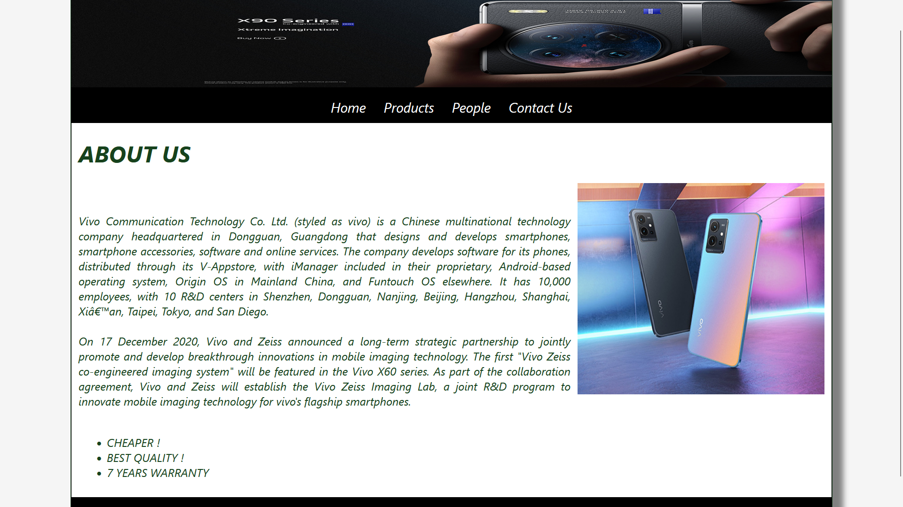
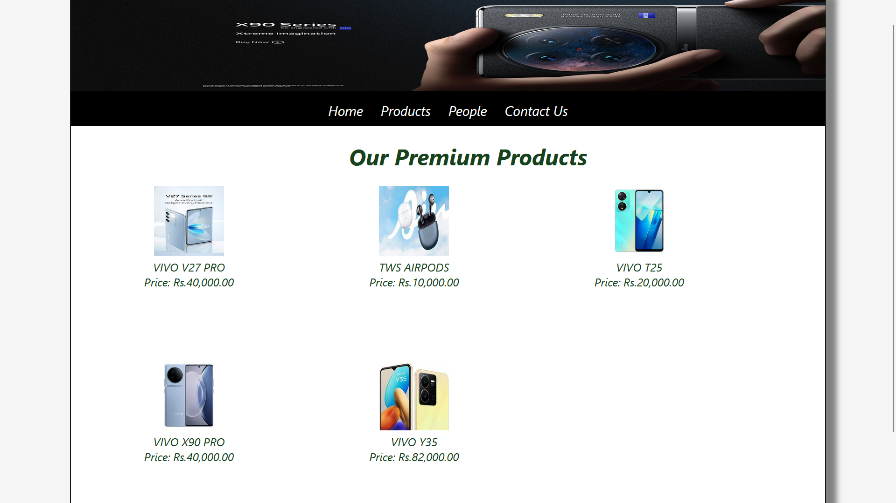
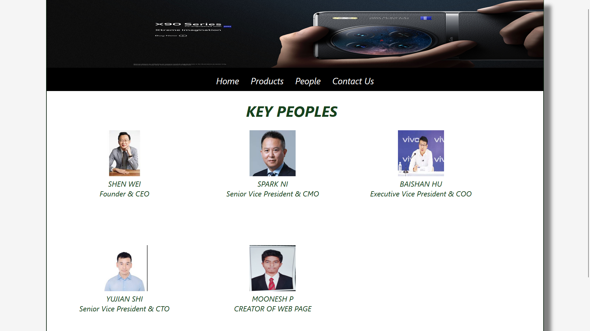
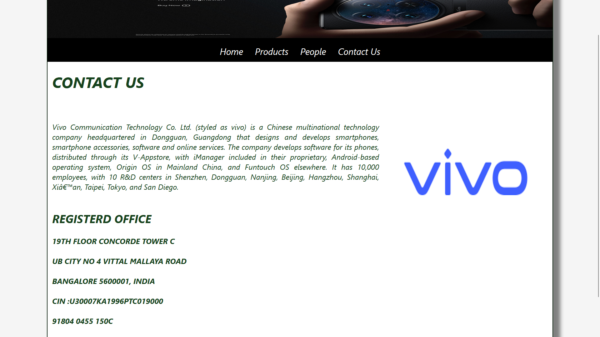

# Web Design for a Software Product Company

## AIM:

To design a static website for a software product company company.

## DESIGN STEPS:

### Step 1:

Requirement collection.

### Step 2:

Creating the layout using HTML and CSS.

### Step 3:

Updating the sample content.

### Step 4:

Choose the appropriate style and color scheme.

### Step 5:

Validate the layout in various browsers.

### Step 6:

Validate the HTML code.

### Step 6:

Publish the website in the given URL.

## CSS CODE:
```css

* {
  box-sizing: border-box;
  font-family: -apple-system, BlinkMacSystemFont, 'Segoe UI', Roboto, Oxygen, Ubuntu, Cantarell, 'Open Sans', 'Helvetica Neue', sans-serif;
  font-style: italic
  ;
}
body {
  background-color: whitesmoke;
  color: #17421d;

}
.container {
  width: 1080px;
  margin-left: auto;
  margin-right: auto;
  border-width: 1px 1px 1px 1px;
  border-style: solid;
  box-shadow: 15px 15px 8px gray;
}

.banner {
    
  display: block;
  width: 100%;
  height: 200x;
  text-align: center;
  font-size: 60px;
  background-image: url("/static/img/uu.jpg");
  background-size: 100% 100%;
  margin: 0px 0px 0px 0px;
  padding-top: 150px;
  color: #ffffff;
  
}

.menu {
  display: block;
  width: 100%;
  height: 50px;
  font-size: larger;
  background-color:black;
  text-align: center;
  padding-top: 15px;
  margin: 0px 0px 0px 0px;
  border-width: 1px;
}

.menuitem {
  display: inline-block;
  margin-left: 10px;
  margin-right: 10px;
}
.menuitemselected {
  display: inline-block;
  margin-left: 10px;
  margin-right: 10px;
  color: #ffffff;
}

.menuitem a {
  text-decoration: none;
  color: white;
}

.content {
  display: block;
  width: 100%;
  background-color: #ffffff;
  min-height: 500px;
  margin: 0px 0px 0px 0px;
  border-width: 1px;
  border-color: rgb(0, 0, 0);
  border-style: solid;
}
.homecontent {
  min-height: 500px;
  margin: 10px 10px 10px 10px;
}
.homecontent h1 {
  text-align: left;
}
.homecontent img {
  float: right;
  width: 350px;
  height: 300px;
  margin-left: 10px;
}

.contenttext {
  text-align: justify;
}

.productcontent {
  min-height: 500px;
  margin: 10px 10px 10px 10px;
}

.productcontent h1 {
  text-align: left;
}

.productitems {
  display: block;
}

.productitem {
  display: inline-block;
  width: 30%;
  height: 250px;
  text-align: center;
}

.productitem img {
  width: 100px;
  height: 100px;
  display: block;
}
.productitem .itemimage {
  display: block;
  margin-left: auto;
  margin-right: auto;
  width: 100px;
  margin-bottom: 5px;
}

.productitem .itemname {
  display: block;
}
.productitem .itemprice {
  display: block;
}

.footer {
  display: block;
  width: 100%;
  height: 40px;
  background-color: #000000;
  text-align: center;
  padding-top: 10px;
  margin: 0px 0px 0px 0px;
  color: #ffffff;
}


```

## HOME PAGE HTML CODE:
```html
<!DOCTYPE html>
<html lang="en">
  <head>
    <title>VIVO BRAND</title>
    <link rel="stylesheet" href="./css/layout.css" />
    <link rel="icon" href="./img/icoo.png" type="image/x-icon" />
  </head>

  <body>
    <div class="container">
        <div class="banner"></div>

      <div class="menu">
        <div class="menuitem"><a href="/static/home.html">Home</a></div>
        <div class="menuitem"><a href="/static/products.html">Products</a></div>
        <div class="menuitem"><a href="/static/people.html">People</a></div>
        <div class="menuitem"><a href="/static/contact.html">Contact Us</a></div>
      </div>
      <div class="content">
        <div class="homecontent">
          <h1>ABOUT US</h1>
          
          <div class="contenttext"><br><br>
            Vivo Communication Technology Co. Ltd. (styled as vivo) is a Chinese multinational technology company headquartered in Dongguan, Guangdong that designs and develops smartphones, smartphone accessories, software and online services. The company develops software for its phones, distributed through its V-Appstore, with iManager included in their proprietary, Android-based operating system, Origin OS in Mainland China, and Funtouch OS elsewhere. It has 10,000 employees, with 10 R&D centers in Shenzhen, Dongguan, Nanjing, Beijing, Hangzhou, Shanghai, Xi’an, Taipei, Tokyo, and San Diego. 
           <br><br>
           On 17 December 2020, Vivo and Zeiss announced a long-term strategic partnership to jointly promote and develop breakthrough innovations in mobile imaging technology. The first "Vivo Zeiss co-engineered imaging system" will be featured in the Vivo X60 series. As part of the collaboration agreement, Vivo and Zeiss will establish the Vivo Zeiss Imaging Lab, a joint R&D program to innovate mobile imaging technology for vivo's flagship smartphones.
            <br><br>
            <ul>
              <li>CHEAPER !</li>
              <li>BEST QUALITY !</li>
              <li>7 YEARS WARRANTY</li>
            </ul>
          </div>
        </div>
      </div>
      <div class="footer">
      </div>
    </div>
  </body>
</html>


```
### PRODUCTS PAGE HTML CODE:
```html
<!DOCTYPE html>
<html lang="en">
  <head>
    <title>VIVO</title>
    <link rel="stylesheet" href="./css/layout.css" />
    <link rel="icon" href="./img/icoo.png" type="image/x-icon" />
  </head>

  <body>
  <div class="container">
           <div class="banner"></div>

      <div class="menu">
        <div class="menuitem"><a href="/static/home.html">Home</a></div>
        <div class="menuitem"><a href="/static/products.html">Products</a></div>
        <div class="menuitem"><a href="/static/people.html">People</a></div>
        <div class="menuitem"><a href="/static/contact.html">Contact Us</a></div>
      </div>
      <div class="content">
        <div class="productcontent">    
          <h1>&nbsp&nbsp&nbsp&nbsp&nbsp&nbsp&nbsp&nbsp&nbsp&nbsp&nbsp&nbsp&nbsp&nbsp&nbsp&nbsp&nbsp&nbsp&nbsp&nbsp&nbsp&nbsp&nbsp&nbsp&nbsp&nbsp&nbsp&nbsp&nbsp&nbsp&nbsp&nbsp&nbsp&nbsp&nbsp&nbsp&nbsp&nbsp&nbsp&nbsp&nbsp&nbsp&nbsp&nbspOur Premium Products</h1>
          <div class="productitems">
              <div class="productitem"> 
                  <div class="itemimage">
                  
                  </div>
                  <div class="itemname">VIVO V27 PRO</div>
                  <div class="itemprice">Price: Rs.40,000.00 </div>
              </div>
              <div class="productitem"> 
                  <div class="itemimage">
                  
                  </div>
                  <div class="itemname">TWS AIRPODS</div>
                  <div class="itemprice">Price: Rs.10,000.00 </div>
              </div>
               <div class="productitem"> 
                  <div class="itemimage">
                  
                  </div>
                  <div class="itemname">VIVO T25</div>
                  <div class="itemprice">Price: Rs.20,000.00 </div>
              </div>
              <div class="productitem"> 
                  <div class="itemimage">
                  
                  </div>
                  <div class="itemname">VIVO X90 PRO</div>
                  <div class="itemprice">Price: Rs.40,000.00 </div>
              </div>
              <div class="productitem"> 
                  <div class="itemimage">
                  
                  </div>
                  <div class="itemname">VIVO Y35</div>
                  <div class="itemprice">Price: Rs.82,000.00 </div>
              </div>
          </div>
          </div>        
      </div>
      <div class="footer">
      </div>
    </div>
  </body>
</html>

```
## PEOPLE PAGE HTML CODE:
```html
<!DOCTYPE html>
<html lang="en">
  <head>
    <title>VIVO</title>
    <link rel="stylesheet" href="./css/layout.css" />
    <link rel="icon" href="./img/icoo.png" type="image/x-icon" />
  </head>

  <body>
 <div class="container">
     <div class="banner"></div>
      <div class="menu">
        <div class="menuitem"><a href="/static/home.html">Home</a></div>
        <div class="menuitem"><a href="/static/products.html">Products</a></div>
        <div class="menuitem"><a href="/static/people.html">People</a></div>
        <div class="menuitem"><a href="/static/contact.html">Contact Us</a></div>
      </div>
      <div class="content">
        <div class="productcontent">    
          <h1>&nbsp&nbsp&nbsp&nbsp&nbsp&nbsp&nbsp&nbsp&nbsp&nbsp&nbsp&nbsp&nbsp&nbsp&nbsp&nbsp&nbsp&nbsp&nbsp&nbsp&nbsp&nbsp&nbsp&nbsp&nbsp&nbsp&nbsp&nbsp&nbsp&nbsp&nbsp&nbsp&nbsp&nbsp&nbsp&nbsp&nbsp&nbsp&nbsp&nbsp&nbsp&nbsp&nbsp&nbsp&nbsp&nbsp&nbsp&nbspKEY PEOPLES</h1>
          <div class="productitems">
              <div class="productitem"> 
                  <div class="itemimage">
                  
                  </div>
                  <div class="itemname">SHEN WEI</div>
                  <div class="itemprice">Founder & CEO</div>
              </div>
              <div class="productitem"> 
                  <div class="itemimage">
                  
                  </div>
                  <div class="itemname">SPARK NI</div>
                  <div class="itemprice">Senior Vice President & CMO</div>
              </div>
               <div class="productitem"> 
                  <div class="itemimage">
                  
                  </div>
                  <div class="itemname">BAISHAN HU</div>
                  <div class="itemprice">Executive Vice President & COO</div>
              </div>
              <div class="productitem"> 
                  <div class="itemimage">
                  
                  </div>
                  <div class="itemname">YUJIAN SHI</div>
                  <div class="itemprice">Senior Vice President & CTO</div>
              </div>
              <div class="productitem"> 
                  <div class="itemimage">
                  
                  </div>
                  <div class="itemname">MOONESH P</div>
                  <div class="itemprice">CREATOR OF WEB PAGE </div>
              </div>
          </div>
          </div>        
      </div>
      <div class="footer">
      </div>
    </div>
  </body>
</html>


```
## CONTACT PAGE HTML CODE:
```html
<!DOCTYPE html>
<html lang="en">
  <head>
    <title>VIVO BRAND</title>
    <link rel="stylesheet" href="./css/layout.css" />
    <link rel="icon" href="./img/icoo.png" type="image/x-icon" />
  </head>

  <body>
    <div class="container">
        <div class="banner"></div>

      <div class="menu">
        <div class="menuitem"><a href="/static/home.html">Home</a></div>
        <div class="menuitem"><a href="/static/products.html">Products</a></div>
        <div class="menuitem"><a href="/static/people.html">People</a></div>
        <div class="menuitem"><a href="/static/contact.html">Contact Us</a></div>
      </div>
      <div class="content">
        <div class="homecontent">
          <h1>CONTACT US</h1>
          
          <div class="contenttext"><br><br>
            Vivo Communication Technology Co. Ltd. (styled as vivo) is a Chinese multinational technology company headquartered in Dongguan, Guangdong that designs and develops smartphones, smartphone accessories, software and online services. The company develops software for its phones, distributed through its V-Appstore, with iManager included in their proprietary, Android-based operating system, Origin OS in Mainland China, and Funtouch OS elsewhere. It has 10,000 employees, with 10 R&D centers in Shenzhen, Dongguan, Nanjing, Beijing, Hangzhou, Shanghai, Xi’an, Taipei, Tokyo, and San Diego. 
           <br><br>
         <h2>REGISTERD OFFICE</h2>
            <h4>19TH FLOOR CONCORDE TOWER C</h4>
            <h4>UB CITY NO 4 VITTAL MALLAYA ROAD</h4>
            <h4>BANGALORE 5600001, INDIA</h4>
            <h4>CIN :U30007KA1996PTC019000</h4>
            <h4>91804 0455 150C</h4>
            <h4>admin@vivo.com</h4>

          </div>
        </div>
      </div>
      <div class="footer">
      </div>
    </div>
  </body>
</html>


```
## HOME PAGE OUTPUT:



## PRODUCT PAGE OUTPUT:



## PEOPLE PAGE OUTPUT:



## CONTACT PAGE OUTPUT:



## Result:

Thus a website is designed for the software product company and the HTML,CSS code are validated
